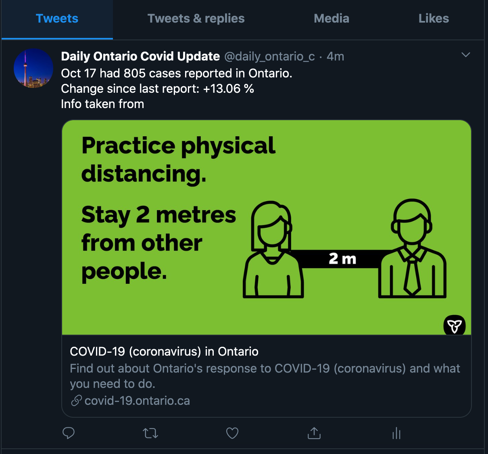

# Daily Ontario Covid Tweets
- I am an Ontario resident who checks the statistics on a daily basis so I can get a sense of the current situation. I wrote this simple bot to make the information more accessible on twitter. My hope is that with more access to information we can all be more informed.
- This code that posts daily Covid numbers for Ontario taken from the offical government website: https://covid-19.ontario.ca/data
- It will check for new numbers on a daily basis and post it to the twitter account of your choice.
- This was created in order to make information more accessible.
- Requires that you have `config.json` file which the field username and password fill
```
{
  "consumerKey": "",
  "applicationKey": "",
  "userAccessToken": "",
  "userSecret": ""
}
```
- To start with UI run: `yarn start`
- To start with command line only run: `yarn run`
- Twitter: [@daily_ontario_c](https://twitter.com/daily_ontario_c)
- Tweet demo

